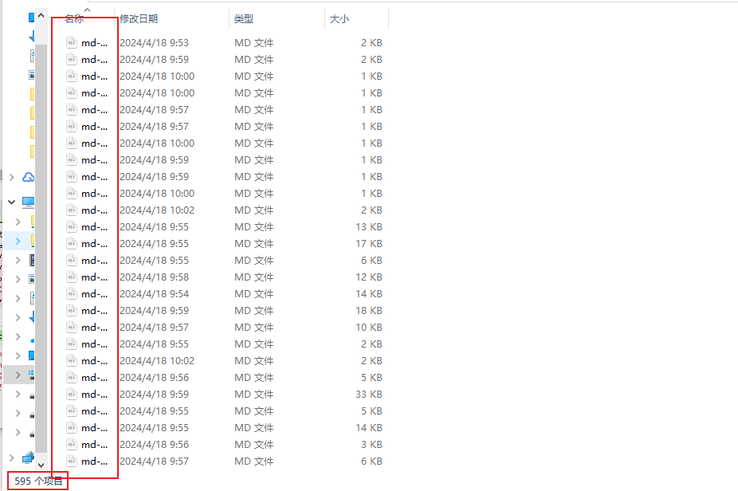

# 使用说明

使用 `NodeJS` 编写脚本，用于备份 `OpenAI Chat` 上的所有对话,并将其保存为 `md` 格式

## 前提条件

确保已安装 `Node.js` 和 `npm`。

该项目暂未完善，对于网络请求失败时，会终止进程，请确保执行脚本的电脑网络环境能够正常访问 `ChatGPT` ，或者你的代理也能正常访问。

## 安装

1. 克隆此仓库到本地计算机：

```bash
git clone https://github.com/ivwv/chatgpt-backup.git
```

1. 进入项目目录：

```bash
cd chatgpt-backup
```

1. 安装依赖：

```bash
npm install
```

## 配置

1. 在项目根目录创建一个名为 `.env` 的文件。
2. 在 `.env` 文件中添加以下内容，并根据需要进行修改：

```bash
HTTP_PROXY=http://your-proxy-url:your-proxy-port
COOKIE=your-cookie-value
ACCESS_TOKEN=your-access-token
```

确保替换以下内容：

- `your-proxy-url` 和 `your-proxy-port`：如果您使用了代理，请提供代理服务器的 URL 和端口号。
- `your-cookie-value`：如果需要使用 cookie，请提供您的 cookie 值。
- `your-access-token`：提供您的访问令牌。

`HTTP_PROXY`: 可选，当你所处的环境本来就能访问`chatgpt`，那么就为空，反之，这填写你的`http`代理，并确保代理正常访问`chatgpt`。

`ACCESS_TOKEN`: 必填，浏览器打开链接:https://chat.openai.com/api/auth/session 完整复制 `accessToken` 到此。

`COOKIE`: 必填，继续在页面中打开浏览器控制台,输入 `document.cookie` 并回车获取当前的 `cookie` ，连同单引号一同复制到此。

## 运行

在项目根目录执行以下命令：

```
node main.js
```

备份文件将保存在 `backup-md` 文件夹中。



## 注意事项

- 确保在启动备份过程之前正确配置了 `.env` 文件。
- 如果网络请求失败，请确保能正常访问 `ChatGPT`。
- 如果发现备份下来的 `md` 内容不美观，那大概率就是你在官网对话时，没有按照`markdown`格式进行编写问题。
